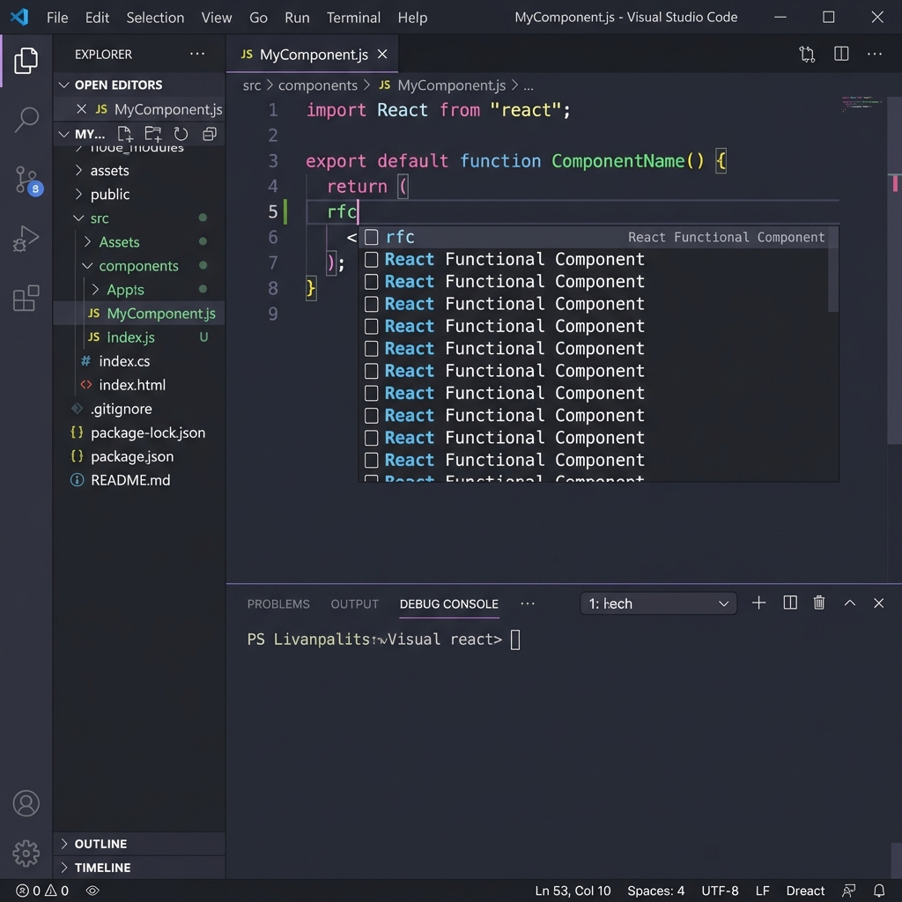

# Snippetz - Ultimate React & Web Snippets 🚀

A premium, comprehensive collection of modern React 18/19, ReactDOM, and Web development snippets for VS Code. Supercharge your workflow with mnemonic prefixes and React 19-ready patterns.

---

## ✨ Features

- **React 19 Ready**: Full support for `useActionState`, `useOptimistic`, `use`, and `cache`.
- **Resource Loading**: Modern React 19 speed optimizations (`prefetch`, `preload`, `preinit`).
- **Smart Import Merger**: Consolidate multiple package imports into a single line with `Merge Package Imports`.
- **Mnemonic Prefixes**: Every prefix follows a logical pattern (`imru...` for hooks, `imrd...` for ReactDOM, etc.).
- **Pro-Tip Documentation**: Clear, actionable advice in VS Code tooltips.

---

## 📸 Demos

### **Consolidate Imports Instantly**

*Clean up messy import blocks with a single command.*

### **Rapid Component Scaffolding**

*Generate full React components in seconds using mnemonic prefixes like `rfc` and `rcc`.*

---

## 🛠️ Commands

### **React Snippets: Merge Package Imports**
Instantly merge multiple lines of the same package into a single professional import. Works with React, Lodash, Framer Motion, and more.

- **How to use**: Open Command Palette (`Cmd/Ctrl+Shift+P`) ➔ Type **"Merge Package Imports"**.

---

## 📦 Snippet Highlights

### **React Core & Hooks (`react`)**

| Prefix | API / Description |
| :--- | :--- |
| `imr` | `import React from 'react';` |
| `imrce` | `createElement` |
| `imrcl` | `cloneElement` |
| `imriv` | `isValidElement` |
| `imrchi` | `Children` utilities |
| `imrc` | `Component` |
| `imrpc` | `PureComponent` |
| `imrf` | `Fragment` |
| `imrsm` | `StrictMode` |
| `imrp` | `Profiler` |
| `imrs` | `Suspense` |
| `imrl` | `lazy` |
| `imrsl` / `imrls` | `Suspense` & `lazy` |
| `imru` | `use` (React 19) |
| `imrus` | `useState` |
| `imrur` | `useReducer` |
| `imruas` | `useActionState` (React 19) |
| `imruo` | `useOptimistic` (React 19) |
| `imrue` | `useEffect` |
| `imrul` | `useLayoutEffect` |
| `imruie` | `useInsertionEffect` |
| `imrurf` | `useRef` |
| `imrcr` | `createRef` |
| `imrfr` | `forwardRef` |
| `imrui` | `useImperativeHandle` |
| `imrcc` | `createContext` |
| `imruc` | `useContext` |
| `imrcon` | `Consumer` |
| `imrm` | `memo` |
| `imrum` | `useMemo` |
| `imrucb` | `useCallback` |
| `imrst` | `startTransition` |
| `imrut` | `useTransition` |
| `imrudv` | `useDeferredValue` |
| `imruses` | `useSyncExternalStore` |
| `imruid` | `useId` |
| `imrud` | `useDebugValue` |
| `imrcache` | `cache` (React 19) |
| `imract` | `act` (React 19) |

### **ReactDOM & Client (`reactdom`)**

| Prefix | API / Description |
| :--- | :--- |
| `imrdcr` | `createRoot` |
| `imrdhr` | `hydrateRoot` |
| `imrdcp` | `createPortal` |
| `imrdfs` | `flushSync` |
| `imrdufs` | `useFormStatus` (React 19) |
| `imrdrfr` | `requestFormReset` (React 19) |
| `imrdufst` | `useFormState` (Legacy) |
| `imrdpd` | `prefetchDNS` |
| `imrdpc` | `preconnect` |
| `imrdpf` | `prefetch` |
| `imrdpl` | `preload` |
| `imrdpm` | `preloadModule` |
| `imrdpi` | `preinit` |
| `imrdpim` | `preinitModule` |
| `imrdr` | `render` (Legacy) |
| `imrdh` | `hydrate` (Legacy) |
| `imrdfn` | `findDOMNode` |
| `imrdu` | `unmountComponentAtNode` |
| `imrdubu` | `unstable_batchedUpdates` |
| `imrd` | `ReactDOM` (Default) |
| `imrdact` | `act` (Legacy) |

### **PropTypes (`proptypes`)**

| Prefix | API / Description |
| :--- | :--- |
| `imrpt` | `import PropTypes from 'prop-types';` |
| `pts` | `PropTypes.string` |
| `ptn` | `PropTypes.number` |
| `ptb` | `PropTypes.bool` |
| `ptf` | `PropTypes.func` |
| `pta` | `PropTypes.array` |
| `pto` | `PropTypes.object` |
| `ptnode` | `PropTypes.node` |
| `ptel` | `PropTypes.element` |
| `ptoo` | `PropTypes.oneOf` |
| `ptoot` | `PropTypes.oneOfType` |
| `ptao` | `PropTypes.arrayOf` |
| `ptsh` | `PropTypes.shape` |
| `ptex` | `PropTypes.exact` |
| `ptsr` | `string.isRequired` |
| `ptnr` | `number.isRequired` |
| `ptbr` | `bool.isRequired` |
| `ptfr` | `func.isRequired` |
| `ptar` | `array.isRequired` |
| `ptor` | `object.isRequired` |
| `cpt` | `Component.propTypes = { ... };` |

### **Generic Imports (`imports`)**

| Prefix | API / Description |
| :--- | :--- |
| `imcss` | Global CSS/SCSS Import |
| `imcssm` | CSS/SCSS Module Import |
| `imcom` | Default Module/Component Import |
| `imcomn` | Named Module/Component Import |
| `imcomall` | Namespace Import (`import * as`) |
| `imse` | Side Effect Import |
| `imsvg` | SVG Asset Import |
| `imimg` | Image Asset Import |
| `imjson` | JSON Data Import |

### **Common Code Snippets (`components`)**

| Prefix | Description |
| :--- | :--- |
| `rus` | `useState` Hook Statement |
| `rue` | `useEffect` with Cleanup/Async |
| `ruc` | `useContext` Hook Statement |
| `rur` | `useReducer` Hook Statement |
| `rucb` | `useCallback` Hook Statement |
| `rum` | `useMemo` Hook Statement |
| `rurf` | `useRef` Hook Statement |
| `rui` | `useImperativeHandle` Hook Statement |
| `rul` | `useLayoutEffect` Hook Statement |
| `rfc` | Functional Component |
| `rfcb` | Functional Component + Boilerplate (State/PropTypes/Export) |
| `rcc` | Class Component |
| `rccb` | Class Component + Boilerplate (Lifecycle/State/PropTypes) |
| `rss` | `this.setState` |
| `rssf` | Functional `this.setState` |
| `rcon` | Class Constructor |
| `rdsp` | `getDerivedStateFromProps` |
| `rcdm` | `componentDidMount` |
| `rscu` | `shouldComponentUpdate` |
| `rsbu` | `getSnapshotBeforeUpdate` |
| `rcdu` | `componentDidUpdate` |
| `rcwu` | `componentWillUnmount` |
| `recb` | `ErrorBoundary` Component Boilerplate |
| `rcp` | `createPortal` Boilerplate |
| `rhce` | `handleChange` Form Event |
| `rhse` | `handleSubmit` Form Event |
| `rdcr` | `createRoot` (React 18/19 simple) |
| `rdcrie` | `createRoot` + Imports + Error Handling |
| `rdhr` | `hydrateRoot` (React 18/19 simple) |
| `rdhrie` | `hydrateRoot` + Imports + Error Handling |

---

## 🚀 Installation

1. Open **VS Code**.
2. Go to **Extensions** (`Cmd/Ctrl+Shift+X`).
3. Search for **"snippetz"** and click **Install**.

---

## 🧪 Made for Developers

This extension is built to get out of your way and let you write code faster. No more manually typing `{ useState, useEffect }` or fixing messy import blocks.

**Made with ❤️ by [Raju Dhami](https://github.com/rajudhami)**

---

## 📜 Recent Updates

### **[2.1.0] - 2026-01-19**
- Added **React 19** specialized hooks and components.
- Added **Web Asset** imports (SVG, Images, JSON).
- Added **Consolidated Import Merger** command.
- Updated all descriptions with professional React 19 guidance.
